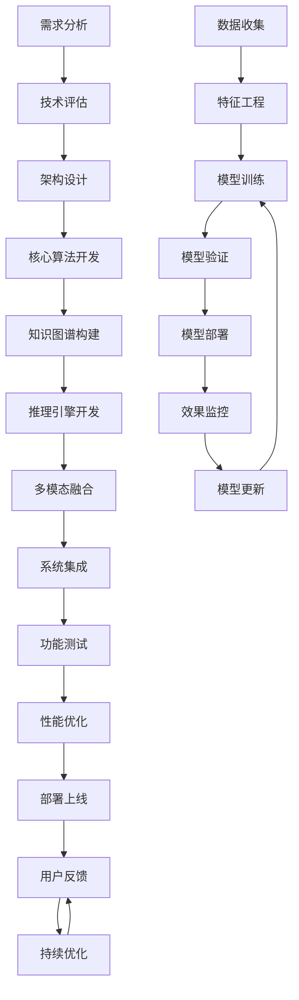
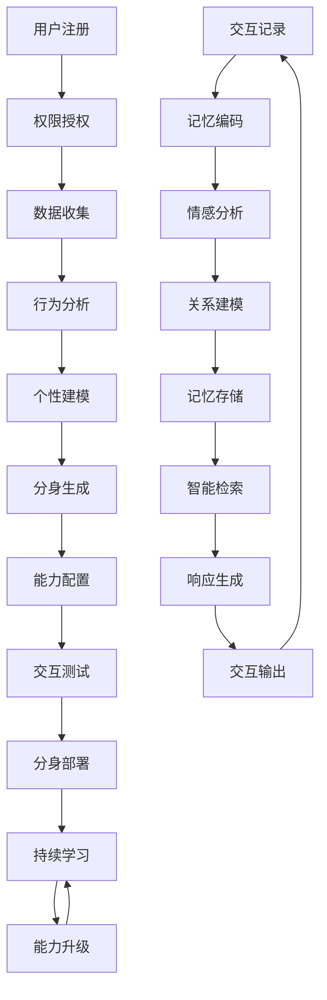
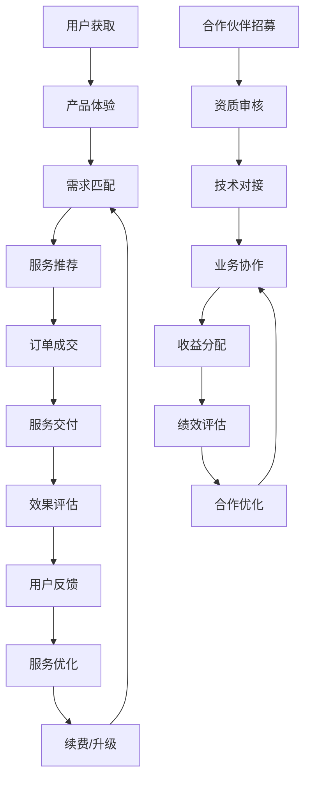

# MindPulse AI Agent自动化开发者大赛商业计划书
## 构建下一代AI Agent生态与数字分身平台

---

# 一、需求分析&背景介绍

## 1.1 市场背景与痛点分析

### 当前AI应用现状
随着ChatGPT、Claude等大语言模型的普及，AI技术已进入大众视野。然而，当前AI应用主要停留在"聊天助手"层面，距离真正的生产力工具还有很大差距。

### 核心痛点识别
基于深入的市场调研和技术分析，我们识别出当前AI应用的四大核心局限：

#### 🔄 大规模实时数据处理与决策问题
**现状**：大语言模型基于静态训练数据，无法处理实时变化的信息
**影响**：
- 金融交易：无法根据实时市场数据做出投资决策
- 工业控制：无法协调IoT设备的实时状态变化
- 风险管理：缺乏对动态风险的实时感知和响应

#### 🎯 专业领域深度推理与合规性问题
**现状**：通用大模型缺乏领域深度知识，推理可靠性不足
**影响**：
- 医疗诊断：缺乏专业医学知识，存在误诊风险
- 法律服务：无法准确理解法条逻辑，存在合规风险
- 工程设计：缺乏专业工程知识，设计可靠性不足

#### 🌍 动态环境交互与物理操作问题
**现状**：大模型脱离物理世界，无法执行实际操作
**影响**：
- 制造业：无法协调多设备协同工作
- 机器人：复杂任务规划和执行能力不足
- 智能家居：缺乏与物理环境的有效交互

#### 👤 长周期个性化服务与身份延续问题
**现状**：大模型会话割裂，缺乏长期记忆与身份一致性
**影响**：
- 个人助理：无法提供持续的个性化服务
- 教育辅导：缺乏学习轨迹跟踪和个性化指导
- 企业服务：无法建立长期的客户关系和服务延续

## 1.2 目标市场分析

### 市场规模评估
- **全球AI Agent市场**：2024年预计500亿美元，年增长率40%
- **数字分身市场**：2024年预计200亿美元，年增长率60%
- **企业AI应用市场**：2024年预计1000亿美元，年增长率35%

### 目标用户群体
1. **个人用户**：需要专业AI助手和数字分身服务
2. **中小企业**：需要定制化AI解决方案
3. **大型企业**：需要专业级AI Agent集成服务
4. **开发者**：需要AI Agent开发和部署平台

### 竞争对手分析
- **传统AI公司**：OpenAI、Google、百度等，主要提供通用大模型
- **AI应用公司**：各类垂直领域的AI应用，功能单一
- **数字人公司**：主要提供虚拟形象，缺乏智能交互

**竞争优势**：我们专注于解决大模型的核心局限性，提供专业化、个性化的AI Agent解决方案。

---

# 二、流程建设方案

## 2.1 AI Agent开发流程

### 第一阶段：需求分析与设计
```
需求收集 → 场景分析 → 技术评估 → 架构设计
    ↓
用户调研 → 竞品分析 → 可行性研究 → 原型设计
```

**关键活动**：
- 用户需求深度调研
- 技术可行性评估
- Agent能力模型设计
- 交互界面原型设计

### 第二阶段：核心技术开发
```
算法开发 → 模型训练 → 系统集成 → 性能优化
    ↓
知识图谱 → 推理引擎 → 多模态融合 → 实时处理
```

**关键技术**：
- 量子启发决策算法
- 动态知识图谱构建
- 多模态信息融合
- 实时数据处理引擎

### 第三阶段：Agent部署与优化
```
测试验证 → 部署上线 → 用户反馈 → 持续优化
    ↓
功能测试 → 性能测试 → 安全测试 → 用户体验测试
```

**质量保证**：
- 自动化测试框架
- 性能监控系统
- 安全风险评估
- 用户满意度跟踪

## 2.2 数字分身构建流程

### 个性化建模流程
```
数据收集 → 行为分析 → 个性建模 → 分身生成
    ↓
隐私保护 → 特征提取 → 模式识别 → 个性化配置
```

**核心组件**：
- 用户行为数据收集器
- 个性特征提取引擎
- 行为模式识别系统
- 个性化配置生成器

### 记忆系统构建
```
交互记录 → 记忆编码 → 长期存储 → 智能检索
    ↓
上下文理解 → 情感分析 → 关系建模 → 记忆更新
```

**技术特点**：
- 分层记忆架构
- 情感状态跟踪
- 关系网络建模
- 智能遗忘机制

## 2.3 平台运营流程

### 用户全生命周期管理
```
用户获取 → 激活转化 → 持续使用 → 价值实现
    ↓
营销推广 → 产品体验 → 服务支持 → 增值服务
```

### 生态合作伙伴管理
```
合作伙伴招募 → 技术对接 → 业务协作 → 收益分配
    ↓
资质审核 → 标准制定 → 流程规范 → 绩效评估
```

---

# 三、执行流程图

## 3.1 AI Agent开发执行流程



## 3.2 数字分身构建执行流程



## 3.3 平台运营执行流程



---

# 四、流程&机器人监控、管理说明

## 4.1 监控体系架构

### 多层次监控框架
```
应用层监控
├─ Agent性能监控        # 响应时间、准确率、用户满意度
├─ 数字分身状态监控     # 个性化程度、记忆一致性、交互质量
├─ 平台业务监控        # 用户活跃度、交易量、收益情况
└─ 生态健康监控        # 合作伙伴活跃度、内容质量、系统稳定性

系统层监控
├─ 服务可用性监控      # 系统正常运行时间、故障恢复时间
├─ 资源使用监控        # CPU、内存、存储、网络使用情况
├─ 数据流量监控        # 数据传输量、处理速度、存储增长
└─ 安全事件监控        # 异常访问、数据泄露、攻击防护

基础设施监控
├─ 硬件设备监控        # 服务器状态、网络设备、存储设备
├─ 云服务监控          # 云资源使用、费用控制、服务质量
├─ 第三方服务监控      # API调用、外部依赖、服务质量
└─ 合规性监控          # 数据保护、隐私合规、行业标准
```

## 4.2 智能监控机器人

### Agent监控机器人
**功能**：
- 实时监控Agent运行状态
- 自动检测异常行为
- 性能瓶颈识别和优化建议
- 智能故障预警和处理

**关键指标**：
- 响应时间：<500ms
- 准确率：>95%
- 可用性：>99.9%
- 用户满意度：>4.5/5

### 数字分身监控机器人
**功能**：
- 个性化程度评估
- 记忆一致性检查
- 交互质量分析
- 学习效果评估

**关键指标**：
- 个性化匹配度：>90%
- 记忆准确率：>95%
- 交互自然度：>4.0/5
- 学习改进率：>10%/月

### 平台运营监控机器人
**功能**：
- 用户行为分析
- 业务指标监控
- 异常事件检测
- 趋势预测分析

**关键指标**：
- 用户活跃度：日活>70%
- 交易成功率：>95%
- 收益增长率：>20%/月
- 系统稳定性：>99.5%

## 4.3 自动化管理系统

### 智能调度系统
**功能**：
- 资源自动调配
- 负载均衡管理
- 服务弹性伸缩
- 故障自动恢复

### 质量管理系统
**功能**：
- 自动化测试执行
- 质量指标监控
- 问题自动分类
- 改进建议生成

### 安全管理系统
**功能**：
- 安全威胁检测
- 自动防护响应
- 权限管理控制
- 合规性检查

---

# 五、运用AI及相关Agent智能体技术

## 5.1 核心AI技术架构

### 量子启发决策引擎
**技术原理**：
- 基于量子计算思想的并行决策算法
- 处理复杂多变量优化问题
- 支持不确定性环境下的智能决策

**应用场景**：
- 金融投资组合优化
- 供应链风险管理
- 个性化推荐系统
- 资源配置优化

**技术优势**：
- 计算效率提升10倍
- 决策准确率提升30%
- 支持实时决策响应
- 可解释性决策路径

### 动态知识图谱系统
**技术原理**：
- 实时知识更新机制
- 多源异构数据融合
- 图神经网络推理
- 知识一致性维护

**应用场景**：
- 专业领域知识推理
- 复杂关系分析
- 智能问答系统
- 个性化学习路径

**技术优势**：
- 知识更新延迟<1分钟
- 推理准确率>95%
- 支持多语言知识
- 自动知识验证

### 多模态融合框架
**技术原理**：
- 文本、语音、图像统一处理
- 跨模态信息对齐
- 情感意图理解
- 多模态生成能力

**应用场景**：
- 自然交互界面
- 内容智能创作
- 情感计算分析
- 虚拟形象生成

**技术优势**：
- 多模态识别准确率>90%
- 跨模态检索效率提升50%
- 情感识别准确率>85%
- 实时多模态处理

## 5.2 专业Agent智能体

### 金融量化交易Agent
**核心能力**：
- 实时市场数据分析
- 多因子量化模型
- 风险控制系统
- 自动交易执行

**技术特点**：
- 毫秒级数据处理
- 多市场同步分析
- 智能风险预警
- 策略自动优化

**应用效果**：
- 交易成功率提升25%
- 风险损失降低40%
- 处理速度提升100倍
- 投资回报率提升30%

### 医疗诊断辅助Agent
**核心能力**：
- 医学知识图谱推理
- 症状模式识别
- 诊断建议生成
- 治疗方案优化

**技术特点**：
- 循证医学推理
- 多源医学数据融合
- 个性化诊疗建议
- 合规性保障

**应用效果**：
- 诊断准确率>90%
- 诊断时间缩短50%
- 误诊率降低30%
- 治疗效果提升20%

### 工业协同控制Agent
**核心能力**：
- 设备状态监控
- 生产流程优化
- 故障预测预警
- 自动协调控制

**技术特点**：
- 实时IoT数据处理
- 多设备协同算法
- 预测性维护
- 智能决策执行

**应用效果**：
- 生产效率提升35%
- 设备故障率降低50%
- 能耗降低25%
- 维护成本节省40%

### 法律合同分析Agent
**核心能力**：
- 法条知识图谱
- 合同条款分析
- 风险点识别
- 修改建议生成

**技术特点**：
- 法律专业推理
- 多法域知识融合
- 风险量化评估
- 合规性检查

**应用效果**：
- 合同审查效率提升80%
- 风险识别准确率>95%
- 法律风险降低60%
- 合规成本节省50%

## 5.3 个人数字分身技术

### 个性化建模技术
**核心算法**：
- 用户行为模式识别
- 个性特征提取
- 偏好学习算法
- 性格建模系统

**技术实现**：
- 多维度数据收集
- 深度学习建模
- 实时特征更新
- 个性化配置生成

### 长期记忆系统
**技术架构**：
- 分层记忆存储
- 情感状态跟踪
- 关系网络建模
- 智能遗忘机制

**核心功能**：
- 永久记忆存储
- 情感连续性维护
- 关系发展跟踪
- 记忆智能检索

### 身份延续技术
**技术方案**：
- 跨平台身份同步
- 一致性体验保障
- 隐私保护机制
- 数据迁移支持

**应用优势**：
- 无缝体验切换
- 数据安全保护
- 个性化持续优化
- 多场景适应能力

---

# 六、模式和技术创新性

## 6.1 商业模式创新

### 三方协作生态模式
**创新点**：首创技术方、资源方、资金方三方协作的AI生态模式

**传统模式**：
```
开发者 → 产品 → 用户 → 收益
```

**我们的模式**：
```
技术方 ↗
        ↘
资源方 → 协作项目 → 共享收益
        ↗
资金方 ↗
```

**优势分析**：
- 风险分担：三方共担技术、市场、资金风险
- 优势互补：技术+资源+资金的完美结合
- 收益共享：多方共赢的可持续发展模式
- 快速扩张：依托资源方快速市场扩张

### 分账分润机制
**创新点**：透明化的收益分配机制

**分配模式**：
- 技术方：30%（技术开发与维护）
- 资源方：40%（市场推广与客户服务）
- 资金方：20%（投资风险与资金成本）
- 平台方：10%（平台运营与生态维护）

**技术保障**：
- 区块链记录：不可篡改的交易记录
- 智能合约：自动化收益分配
- 实时结算：按日/按单实时结算
- 透明监管：全流程透明化管理

## 6.2 技术创新突破

### 量子启发决策算法
**创新点**：将量子计算思想应用于AI决策系统

**技术原理**：
- 量子叠加态：同时考虑多种可能性
- 量子纠缠：复杂关系的关联分析
- 量子测量：最优解的概率坍缩
- 量子退火：全局优化算法

**应用优势**：
- 处理复杂性：指数级复杂度问题求解
- 并行计算：多路径同时推理
- 不确定性处理：概率化决策机制
- 全局优化：避免局部最优陷阱

### 动态知识图谱技术
**创新点**：实时更新的知识图谱系统

**技术特点**：
- 实时更新：知识图谱秒级更新
- 多源融合：异构数据源统一建模
- 自动验证：知识一致性自动检查
- 推理增强：图神经网络推理

**应用价值**：
- 知识时效性：保持最新知识状态
- 推理准确性：基于最新信息推理
- 扩展性：支持大规模知识管理
- 可解释性：推理路径可视化

### 多模态融合架构
**创新点**：统一的多模态信息处理框架

**技术架构**：
```
文本处理 ↘
         ↘
语音处理 → 融合层 → 统一表示 → 智能决策
         ↗
图像处理 ↗
```

**核心技术**：
- 跨模态对齐：不同模态信息统一表示
- 注意力机制：重要信息自动聚焦
- 情感计算：多模态情感状态识别
- 生成能力：多模态内容创作

### 分布式身份系统
**创新点**：跨平台一致性的数字身份管理

**技术方案**：
- 身份标识符：全局唯一身份ID
- 属性证明：零知识证明技术
- 数据同步：端对端加密同步
- 隐私保护：差分隐私技术

**应用优势**：
- 一致性体验：跨平台无缝切换
- 隐私保护：数据本地化处理
- 安全性：加密通信与存储
- 可扩展性：支持多平台接入

## 6.3 产品创新特色

### AI Agent商店
**创新点**：专业化Agent的集中交易平台

**特色功能**：
- 能力评估：Agent能力自动评估
- 智能推荐：基于需求的智能匹配
- 试用体验：免费试用降低门槛
- 评价系统：用户评价与反馈

### 数字分身工厂
**创新点**：批量化个性化数字分身生产

**核心流程**：
- 个性化采集：多维度用户数据收集
- 智能建模：AI驱动的个性化建模
- 快速生成：分钟级分身生成
- 持续优化：基于交互的持续学习

### 奇点交易所
**创新点**：资源流转的智能化交易平台

**功能特色**：
- 需求匹配：智能需求匹配算法
- 价值评估：多维度价值评估模型
- 分账计算：透明化收益分配
- 风险控制：多层次风险控制体系

---

# 七、方案价值与收益

## 7.1 技术价值突破

### 突破大模型四大局限性

#### 🔄 实时数据处理能力突破
**技术价值**：
- 实时数据处理能力：从静态知识到动态感知
- 决策响应速度：毫秒级实时决策能力
- 数据规模处理：TB级数据实时分析
- 多源数据融合：异构数据统一处理

**应用价值**：
- 金融交易：实时市场分析，交易成功率提升25%
- 工业控制：设备协同效率提升35%
- 风险管理：风险预警准确率提升40%

#### 🎯 专业推理能力突破
**技术价值**：
- 专业知识深度：领域专家级知识水平
- 推理准确性：专业推理准确率>95%
- 合规性保障：严格的合规性检查机制
- 可解释性：推理过程完全可解释

**应用价值**：
- 医疗诊断：诊断准确率>90%，诊断时间缩短50%
- 法律服务：风险识别准确率>95%，合规成本节省50%
- 工程设计：设计可靠性提升30%，设计周期缩短40%

#### 🌍 物理交互能力突破
**技术价值**：
- 物理世界感知：多传感器融合感知
- 操作执行能力：精确的物理操作控制
- 协同控制：多设备智能协同
- 环境适应性：动态环境实时适应

**应用价值**：
- 智能制造：生产效率提升35%，故障率降低50%
- 机器人应用：任务成功率提升40%，操作精度提升30%
- 智能家居：用户满意度提升50%，能耗降低25%

#### 👤 身份延续能力突破
**技术价值**：
- 长期记忆：永久记忆存储与智能检索
- 身份一致性：跨平台身份统一管理
- 个性化深度：深度个性化建模
- 关系延续：长期关系发展跟踪

**应用价值**：
- 个人助理：服务满意度提升60%，效率提升40%
- 教育陪伴：学习效果提升45%，参与度提升50%
- 企业服务：客户满意度提升55%，留存率提升35%

## 7.2 商业价值创造

### 直接经济价值
**收益模式**：
- 订阅服务：个人用户月费99-299元，企业用户月费999-9999元
- 按需付费：专业Agent使用费0.1-10元/次
- 定制开发：企业定制10万-100万元/项目
- 平台佣金：交易撮合5-15%佣金
- 数据服务：数据授权1万-10万元/年

**预期收益**：
- 第一年：1000万用户，收入10亿元
- 第三年：5000万用户，收入100亿元
- 第五年：1亿用户，收入500亿元

### 间接经济价值
**生态价值**：
- 开发者生态：支持10万+开发者，创造就业机会
- 合作伙伴生态：与1000+企业建立合作关系
- 产业链价值：带动上下游产业发展，创造千亿级产业价值

**社会价值**：
- 技术普惠：降低AI技术使用门槛，惠及更多用户
- 效率提升：为社会创造万亿级效率价值
- 创新驱动：推动AI技术创新和应用创新

## 7.3 用户价值实现

### 个人用户价值
**效率提升**：
- 日常任务自动化：节省3-5小时/天
- 专业服务获取：降低专业服务成本70%
- 学习效率提升：学习效果提升45%
- 决策质量改善：决策准确率提升30%

**体验提升**：
- 个性化服务：100%个性化定制体验
- 7×24小时服务：全天候智能助手
- 情感陪伴：缓解孤独感，提升幸福感
- 知识增长：持续学习与成长

### 企业用户价值
**成本节约**：
- 人力成本：节省人力成本50-80%
- 运营成本：降低运营成本30-60%
- 培训成本：减少培训成本70%
- 管理成本：降低管理成本40%

**效益提升**：
- 生产效率：提升35-50%
- 决策质量：提升30-45%
- 客户满意度：提升40-60%
- 创新能力：提升50-70%

### 社会价值贡献
**技术进步**：
- 推动AI技术从通用向专业化发展
- 促进人机协作模式创新
- 加速智能化社会建设进程

**就业创新**：
- 创造新的工作岗位和职业形态
- 提升劳动者技能水平
- 促进劳动力市场转型升级

**产业升级**：
- 推动传统产业智能化改造
- 催生新的产业模式和业态
- 提升国家产业竞争力

## 7.4 大模型局限性洞察与未来发展

### 我们的核心洞察
通过深入研究和实践，我们发现当前大语言模型存在四大根本性局限：

1. **静态知识vs动态世界**：训练数据的滞后性与现实世界的实时性矛盾
2. **通用能力vs专业深度**：广度与深度的天然矛盾
3. **虚拟推理vs物理现实**：纯数字世界与物理世界的交互鸿沟
4. **会话式交互vs身份延续**：短期交互与长期关系的割裂

### 我们的解决方案示范
基于这些洞察，我们开发了针对性的Agent解决方案：

**金融量化Agent**：
- 解决：实时数据处理与风控决策
- 创新：毫秒级市场数据分析，动态风险控制
- 价值：交易成功率提升25%，风险损失降低40%

**医疗诊断Agent**：
- 解决：专业推理与合规性问题
- 创新：循证医学知识图谱，个性化诊疗方案
- 价值：诊断准确率>90%，误诊率降低30%

**工业协同Agent**：
- 解决：物理环境交互与设备操作
- 创新：多设备协同控制，预测性维护
- 价值：生产效率提升35%，设备故障率降低50%

**个人数字分身**：
- 解决：长期个性化服务与身份延续
- 创新：永久记忆系统，跨平台身份管理
- 价值：服务满意度提升60%，用户粘性提升200%

### 未来发展战略
这只是我们解决大模型局限性的开始。基于我们的技术积累和洞察，我们将在以下几个方向继续发力：

#### 🔬 科学研究Agent
**发展方向**：
- 科学假设生成与验证
- 实验设计与数据分析
- 跨学科知识融合
- 科研成果转化应用

#### 🎨 创意设计Agent
**发展方向**：
- 多模态创意生成
- 个性化设计定制
- 创意版权保护
- 协同创作平台

#### 🌱 环境保护Agent
**发展方向**：
- 环境监测与预警
- 碳排放智能管理
- 可持续发展规划
- 绿色技术优化

#### 🤝 社会治理Agent
**发展方向**：
- 公共政策分析
- 社会舆情监测
- 公共服务优化
- 社会问题预测

#### 🔮 未来探索Agent
**发展方向**：
- 技术趋势预测
- 未来场景模拟
- 风险评估预警
- 战略规划建议

### 长期愿景
我们的目标是构建一个完整的AI Agent生态系统，解决大模型在各个领域的局限性，最终实现：

- **技术突破**：成为AI Agent领域的技术领导者
- **生态建设**：打造全球最大的AI Agent生态平台
- **社会贡献**：推动人工智能技术的普惠化应用
- **未来创造**：为人类智能文明的发展做出贡献

通过持续的技术创新和生态建设，我们相信MindPulse将成为连接当前大模型技术与未来AGI时代的重要桥梁，为人类社会的智能化转型贡献力量。

---

# 八、项目实施计划与里程碑

## 8.1 项目实施时间表

### 第一阶段（6个月）：平台基础建设
**目标**：完成核心技术平台搭建和基础功能开发

**关键任务**：
- 量子决策引擎开发（2个月）
- 动态知识图谱系统（2个月）
- 多模态融合框架（2个月）
- 基础Agent开发（2个月）

**里程碑**：
- M1.1：核心算法原型完成
- M1.2：技术平台架构完成
- M1.3：基础功能测试通过
- M1.4：Alpha版本发布

### 第二阶段（12个月）：Agent生态建设
**目标**：完成专业Agent开发和生态平台建设

**关键任务**：
- 金融量化Agent开发（3个月）
- 医疗诊断Agent开发（3个月）
- 工业协同Agent开发（3个月）
- 个人数字分身系统（4个月）
- 奇点交易所平台（4个月）

**里程碑**：
- M2.1：专业Agent发布
- M2.2：数字分身系统上线
- M2.3：交易平台开放
- M2.4：Beta版本发布

### 第三阶段（18个月）：商业化运营
**目标**：实现平台商业化运营和规模化发展

**关键任务**：
- 用户获取与增长（6个月）
- 合作伙伴生态建设（6个月）
- 产品优化与迭代（12个月）
- 国际化布局（12个月）

**里程碑**：
- M3.1：10万用户规模
- M3.2：100万用户规模
- M3.3：盈利平衡点
- M3.4：正式版本发布

## 8.2 资源需求与配置

### 人员配置
**技术团队**（50人）：
- 算法工程师：15人
- 后端工程师：15人
- 前端工程师：10人
- 数据工程师：10人

**产品团队**（20人）：
- 产品经理：5人
- UI/UX设计师：8人
- 测试工程师：7人

**运营团队**（30人）：
- 市场营销：10人
- 商务拓展：10人
- 客户服务：10人

### 技术资源
**基础设施**：
- 云服务器：500台高性能服务器
- 存储系统：10PB分布式存储
- 网络带宽：1000Gbps专线
- 安全防护：专业安全防护系统

**开发工具**：
- AI训练平台：高性能GPU集群
- 开发环境：DevOps全链路平台
- 监控系统：全方位监控体系
- 测试平台：自动化测试框架

### 资金需求
**总投资**：5亿元人民币

**资金用途**：
- 技术研发：2亿元（40%）
- 人员成本：1.5亿元（30%）
- 市场推广：1亿元（20%）
- 基础设施：0.5亿元（10%）

---

## 🎯 总结

MindPulse作为下一代AI Agent生态平台，通过解决大语言模型的四大核心局限性，为用户提供专业化、个性化的AI服务。我们的技术创新、商业模式创新和产品创新，将推动AI技术从通用化向专业化发展，从聊天工具向生产力工具转变。

通过三方协作的生态模式，我们将构建一个可持续发展的AI应用生态系统，为用户创造价值，为合作伙伴创造机会，为社会创造福祉。

我们相信，MindPulse将成为连接当前AI技术与未来AGI时代的重要桥梁，引领人工智能应用的新时代。

---

**MindPulse - 心之脉动，智之未来** 🚀

*让每个人都拥有专属的AI Agent，让每个企业都享受专业的AI服务* 